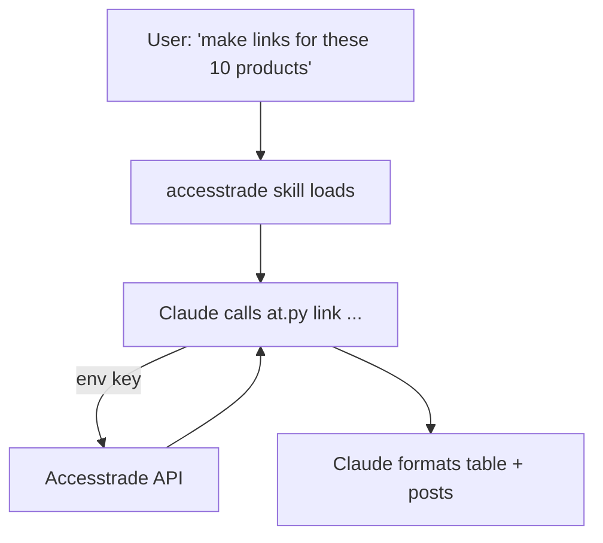

# Designing an Accesstrade skill for Claude Code

**Wrap the Accesstrade API once as a single skill whose `SKILL.md` carries the *playbook* and whose bundled script carries the *HTTP/auth plumbing* — then every affiliate task becomes a natural-language request.** Putting the credential and request logic in a script (not the prompt) keeps the token out of context and makes calls deterministic.

## Layout

```text
~/.claude/skills/accesstrade/
├── SKILL.md          # when-to-use + command recipes
├── reference.md      # full endpoint table (loaded on demand)
└── scripts/
    └── at.py         # reads $ACCESSTRADE_KEY, calls the API, prints JSON
```

## SKILL.md sketch

```yaml
---
name: accesstrade
description: >
  Operate the Accesstrade affiliate API: list/join campaigns, mint tracking
  links, pull conversion/earnings reports, fetch datafeeds and coupons.
  Use when the user mentions Accesstrade, affiliate links, commissions, or campaigns.
allowed-tools: Bash(python3 *)
---

# Accesstrade

Use the bundled client; it injects auth from $ACCESSTRADE_KEY.

- Campaigns:  `python3 ${CLAUDE_SKILL_DIR}/scripts/at.py campaigns --running`
- New link:   `python3 ${CLAUDE_SKILL_DIR}/scripts/at.py link --campaign X --url U --sub1 S`
- Earnings:   `python3 ${CLAUDE_SKILL_DIR}/scripts/at.py conversions --since 7d`

For the full endpoint list and params, see [reference.md](reference.md).
Never print the key. Report money as approved vs pending separately.
```

## The script does the dangerous parts

`at.py` owns: reading the key from env, the `Authorization: Token` header, pagination loops, the 5-min/7-day windowing for reports, and JSON output Claude can parse. Claude orchestrates; the script executes. This is the [[Claude Code Skill anatomy|"script does the work, Claude orchestrates"]] pattern.



## Design choices

- **Read vs write split:** consider `disable-model-invocation: true` on a *separate* write skill (link minting, applying to campaigns) so Claude never takes money-moving actions unprompted; keep read/report auto-invocable.
- **`context: fork`** for heavy report pulls so a 30-day windowed crawl doesn't bloat the main conversation.
- Bundle the endpoint table in `reference.md` so it loads only when Claude needs exact params — keeps the body light.

## Related

- [[Claude Code Skill anatomy]]
- [[Secrets handling for affiliate API keys]]
- [[Claude Code hooks event model]]
- [[Skills vs Hooks vs MCP vs subagents]]
- [[Accesstrade API Integration - MOC]]

%% ai-graph-start %%

**Related notes:**
- [[Claude Code Skill anatomy]]
- [[Accesstrade API Integration - MOC]]
- [[Use case - bulk tracking link generation]]
- [[Claude Code hooks event model]]
- [[Skills vs Hooks vs MCP vs subagents]]

**Relations:**
- Accesstrade skill — *is designed for* — Claude Code
- Accesstrade skill — *wraps* — Accesstrade API
- SKILL.md — *carries* — playbook
- at.py — *carries* — HTTP/auth plumbing
- at.py — *reads* — $ACCESSTRADE_KEY
- at.py — *calls* — Accesstrade API
- at.py — *prints* — JSON output
- Accesstrade skill — *includes file* — SKILL.md
- Accesstrade skill — *includes file* — reference.md
- Accesstrade skill — *includes script* — at.py
- SKILL.md — *specifies allowed tool* — Bash
- SKILL.md — *specifies allowed tool* — python3
- SKILL.md — *refers to* — reference.md
- at.py — *handles* — Authorization: Token
- Claude — *orchestrates* — at.py
- at.py — *executes* — commands
- Claude — *calls* — at.py
- at.py — *interacts with* — Accesstrade API
- Claude — *formats* — reports
- Claude Code Skill anatomy — *describes pattern* — script does the work, Claude orchestrates
- disable-model-invocation: true — *is a design choice for* — write skill
- context: fork — *is a design choice for* — reports
- reference.md — *contains* — endpoint table
- Accesstrade skill — *is related to* — Claude Code Skill anatomy
- Accesstrade skill — *is related to* — Secrets handling for affiliate API keys
- Accesstrade skill — *is related to* — Claude Code hooks event model
- Accesstrade skill — *is related to* — Skills vs Hooks vs MCP vs subagents
- Accesstrade skill — *is related to* — Accesstrade API Integration - MOC
- credential — *is kept out of* — token
- request logic — *is kept out of* — token
- Accesstrade skill — *operates on* — campaigns
- Accesstrade skill — *operates on* — tracking links
- Accesstrade skill — *operates on* — reports
- Accesstrade skill — *operates on* — datafeeds
- Accesstrade skill — *operates on* — coupons

%% ai-graph-end %%