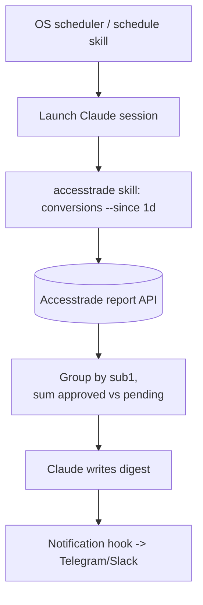

# Use case - automated daily conversion digest

**Goal: every morning, Claude pulls yesterday's conversions, separates approved vs pending revenue, ranks the top-earning content by `sub1`, and sends a one-paragraph digest to your phone.** This turns the [[Accesstrade conversion and transaction reporting|reporting API]] into a passive dashboard you never open.

## Flow

## Build recipe

1. **Schedule** a daily Claude run (cron / the `schedule` or `loop` skill).
2. The [[Designing an Accesstrade skill for Claude Code|accesstrade skill]] fetches a trailing-24h (or 7d) window — well within the [[Accesstrade API rate limits and pagination|1-req/5-min, 7-day]] limit.
3. Claude aggregates: total approved, total pending, top 5 `sub1` by reward, biggest single sale, any newly-rejected conversions.
4. A **`Notification` or `Stop` hook** forwards the digest to Telegram/Slack/Zalo (installers already exist in this vault).

## Why it works well

- **Incremental:** use `periodBase = UPDATED_DATE` so you also catch yesterday's pending sales that flipped to approved today.
- **Cheap context:** run the pull in a `context: fork` subagent; only the finished digest returns to your main thread.
- **Honest numbers:** approved and pending are reported separately so you never celebrate revenue a merchant later cancels.

## Variations

- Weekly EPC-by-content report (revenue ÷ clicks per `sub1`).
- Alert-only mode: stay silent unless a threshold (e.g. >1M VND/day or a rejection spike) is crossed.

## Related

- [[Accesstrade conversion and transaction reporting]]
- [[Accesstrade API rate limits and pagination]]
- [[Claude Code hooks event model]]
- [[Accesstrade SubID attribution]]
- [[Accesstrade API Integration - MOC]]

%% ai-graph-start %%

**Related notes:**
- [[Designing an Accesstrade skill for Claude Code]]
- [[Accesstrade API Integration - MOC]]
- [[Use case - campaign discovery and datafeed content briefs]]
- [[Accesstrade postback and S2S conversion tracking]]
- [[Use case - bulk tracking link generation]]

**Relations:**
- automated daily conversion digest — *has goal* — Claude
- Claude — *pulls* — conversions
- Claude — *separates* — approved revenue
- Claude — *separates* — pending revenue
- Claude — *ranks* — top-earning content
- top-earning content — *ranked by* — sub1
- Claude — *sends* — digest
- digest — *sent to* — phone
- Accesstrade conversion and transaction reporting API — *becomes* — passive dashboard
- OS scheduler — *launches* — Claude session
- schedule skill — *launches* — Claude session
- Claude session — *uses* — accesstrade skill
- accesstrade skill — *queries* — Accesstrade report API
- Accesstrade report API — *provides data for* — aggregation
- aggregation — *groups by* — sub1
- aggregation — *sums* — approved revenue
- aggregation — *sums* — pending revenue
- Claude — *writes* — digest
- digest — *triggers* — Notification hook
- Notification hook — *sends to* — Telegram
- Notification hook — *sends to* — Slack
- Notification hook — *sends to* — Zalo
- daily Claude run — *is scheduled by* — OS scheduler
- daily Claude run — *is scheduled by* — schedule skill
- daily Claude run — *is scheduled by* — loop skill
- accesstrade skill — *fetches* — trailing-24h window
- accesstrade skill — *fetches* — 7d window
- accesstrade skill — *operates within* — Accesstrade API rate limits and pagination
- Claude — *aggregates* — total approved
- Claude — *aggregates* — total pending
- Claude — *aggregates* — top 5 sub1 by reward
- Claude — *aggregates* — biggest single sale
- Claude — *aggregates* — newly-rejected conversions
- Notification hook — *forwards* — digest
- Stop hook — *forwards* — digest
- digest — *is forwarded to* — Telegram
- digest — *is forwarded to* — Slack
- digest — *is forwarded to* — Zalo
- automated daily conversion digest — *uses* — periodBase = UPDATED_DATE
- periodBase = UPDATED_DATE — *catches* — pending sales
- pull — *runs in* — context: fork
- context: fork — *creates* — subagent
- subagent — *returns* — digest
- digest — *returned to* — main thread
- approved revenue — *is reported separately from* — pending revenue
- merchant — *can cancel* — revenue
- Weekly EPC-by-content report — *calculates* — revenue
- revenue — *divided by* — clicks
- clicks — *per* — sub1
- Alert-only mode — *activates on* — threshold
- Alert-only mode — *activates on* — 1M VND/day
- Alert-only mode — *activates on* — rejection spike
- automated daily conversion digest — *is related to* — Accesstrade conversion and transaction reporting API
- automated daily conversion digest — *is related to* — Accesstrade API rate limits and pagination
- automated daily conversion digest — *is related to* — Claude Code hooks event model
- automated daily conversion digest — *is related to* — Accesstrade SubID attribution
- automated daily conversion digest — *is related to* — Accesstrade API Integration - MOC

%% ai-graph-end %%