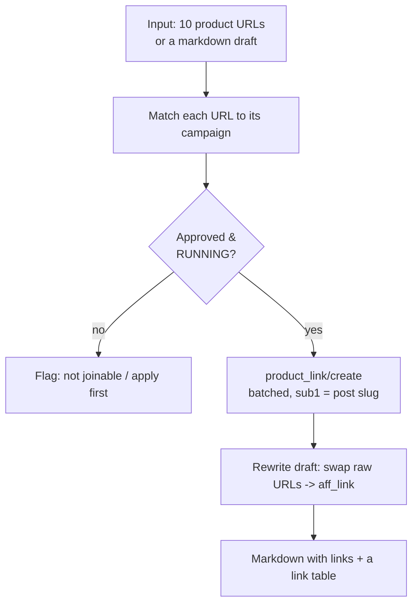

# Use case - bulk tracking link generation

**Goal: hand Claude a list of product URLs (or a draft article) and get back attributed affiliate links — correctly campaign-matched, consistently SubID-tagged, and ready to paste — in one pass.** This removes the most tedious, error-prone affiliate chore.

## Flow

## Build recipe

1. Claude resolves each URL's merchant → [[Accesstrade Campaigns API|campaign]] (and flags any you're not approved on, so you can apply first).
2. Calls [[Accesstrade tracking link creation|`product_link/create`]] **batched** (multiple `urls` per request), stamping a consistent `sub1` = the content slug — see [[Accesstrade SubID attribution]].
3. Returns both a **link table** (origin → `aff_link` → `short_link`) and, if you gave a draft, the **rewritten article** with links swapped in.

## Guardrails (where hooks earn their keep)

- A **`PreToolUse` hook** denies minting against a paused/unapproved campaign, so you never ship a dead link — see [[Claude Code hooks event model]].
- A **`PostToolUse` hook** appends every minted link to a ledger CSV for later reconciliation against conversions.

## Efficiency notes

- **Idempotency:** cache by `(campaign_id, url, subs)`; identical inputs return the same link, so re-runs don't spam the API — see [[Affiliate API engineering best practices]].
- Disclose affiliate relationships in the output template — see [[Affiliate compliance and link hygiene]].

## Related

- [[Accesstrade tracking link creation]]
- [[Accesstrade Campaigns API]]
- [[Claude Code hooks event model]]
- [[Affiliate compliance and link hygiene]]
- [[Accesstrade API Integration - MOC]]

%% ai-graph-start %%

**Related notes:**
- [[Use case - campaign discovery and datafeed content briefs]]
- [[Accesstrade API Integration - MOC]]
- [[Affiliate compliance and link hygiene]]
- [[Designing an Accesstrade skill for Claude Code]]
- [[Claude Code hooks event model]]

**Relations:**
- Bulk tracking link generation — *HAS_GOAL* — Affiliate links
- Claude — *PERFORMS* — Bulk tracking link generation
- Claude — *ACCEPTS_INPUT* — Product URLs
- Claude — *ACCEPTS_INPUT* — Draft article
- Claude — *GENERATES* — Affiliate links
- Affiliate links — *ARE* — campaign-matched
- Affiliate links — *ARE* — SubID-tagged
- Claude — *USES* — Accesstrade Campaigns API
- Claude — *CALLS* — `product_link/create`
- URL — *IS_MATCHED_TO* — Campaigns
- URL — *IS_RESOLVED_TO* — Merchant
- Merchant — *IS_RESOLVED_TO* — Campaigns
- `product_link/create` — *USES_PARAMETER* — sub1
- sub1 — *IS* — Content slug
- Accesstrade SubID attribution — *EXPLAINS* — SubID
- Claude — *RETURNS* — Link table
- Claude — *RETURNS* — Rewritten article
- `PreToolUse` hook — *DENIES* — minting against a paused/unapproved campaign
- `PreToolUse` hook — *PREVENTS* — Dead link
- `PreToolUse` hook — *IS_DEFINED_IN* — Claude Code hooks event model
- `PostToolUse` hook — *APPENDS* — Affiliate links
- `PostToolUse` hook — *TO* — Ledger CSV
- `PostToolUse` hook — *IS_DEFINED_IN* — Claude Code hooks event model
- Idempotency — *USES* — Cache
- Idempotency — *PREVENTS* — API spam
- Affiliate API engineering best practices — *EXPLAINS* — Idempotency
- Affiliate compliance and link hygiene — *COVERS* — Affiliate relationships
- Bulk tracking link generation — *RELATED_TO* — Accesstrade tracking link creation
- Bulk tracking link generation — *RELATED_TO* — Accesstrade Campaigns API
- Bulk tracking link generation — *RELATED_TO* — Claude Code hooks event model
- Bulk tracking link generation — *RELATED_TO* — Affiliate compliance and link hygiene
- Bulk tracking link generation — *RELATED_TO* — Accesstrade API Integration - MOC
- Campaigns — *HAVE_STATUS* — Approved & Running
- Draft article — *IS_REWRITTEN_WITH* — Affiliate links
- `product_link/create` — *IS* — batched

%% ai-graph-end %%