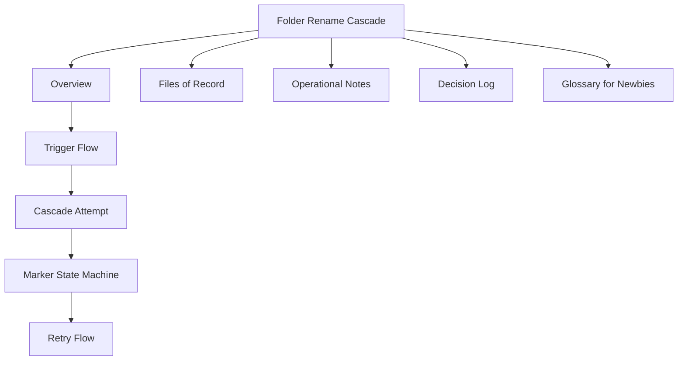

# Folder Rename Cascade

> Ticket: **LUZ-154157** - eArchive backend P1.4.3 cascade changes
> Branch: `kepler/sprint-157/LUZ-154157-...`
> Status: rolled out to dev (latest tag `3661b7c`)

## Start here

This note explains what happens when a folder is renamed and the system must update every document that stores that folder name.

If you are new to the topic, read in this order:

1. [[01 Overview - Folder Rename Cascade|Overview]]
2. [[02 Trigger Flow|Trigger flow]]
3. [[03 Cascade Attempt|Cascade attempt]]
4. [[04 Marker State Machine|Marker state machine]]
5. [[05 Retry Flow|Retry flow]]
6. [[06 Files of Record|Files of record]]
7. [[07 Operational Notes|Operational notes]]
8. [[08 Decision Log|Decision log]]
9. [[09 Glossary for Newbies|Glossary for newbies]]

## TL;DR

When a folder is renamed through `PUT /folders/{id}` or `PATCH /folders/{id}`, every document that references that folder must update the matching entry in its materialized `_folderNames` array.

The update runs on the server in one MongoDB aggregation-pipeline `updateMany`, without paging through documents one page at a time. If MongoDB reports that some matched documents were not modified, the system keeps a row in the tenant's `materializeCascade` collection so a later request can retry the unfinished work.

## Obsidian map



## Key idea in plain English

Think of a document as storing two matching lists:

```text
folderIds:     [123, 456]
_folderNames:  [Inbox, Contracts]
```

If folder `456` is renamed from `Contracts` to `Legal`, the system only changes the second name:

```text
folderIds:     [123, 456]
_folderNames:  [Inbox, Legal]
```

The folder ID stays stable. Only the stored display name changes.

%% ai-graph-start %%

**Related notes:**
- [[01 Overview - Folder Rename Cascade]]
- [[03 Cascade Attempt]]
- [[07 Operational Notes]]
- [[02 Trigger Flow]]
- [[luz_docs has two materialize cascade delivery mechanisms]]

**Relations:**
- folder-rename-cascade — *is ticket* — LUZ-154157
- LUZ-154157 — *is part of* — eArchive backend P1.4.3
- folder-rename-cascade — *rolled out to* — dev
- dev — *has latest tag* — 3661b7c
- folder-rename-cascade — *explains* — folder
- folder — *rename affects* — document
- document — *stores* — _folderNames
- folder — *rename triggered by* — PUT /folders/{id}
- folder — *rename triggered by* — PATCH /folders/{id}
- _folderNames — *updated by* — MongoDB
- MongoDB — *uses* — aggregation-pipeline
- aggregation-pipeline — *performs* — updateMany
- updateMany — *modifies* — document
- system — *uses collection* — materializeCascade
- materializeCascade — *supports* — Retry Flow
- folder-rename-cascade — *includes topic* — Overview
- folder-rename-cascade — *includes topic* — Trigger Flow
- folder-rename-cascade — *includes topic* — Cascade Attempt
- folder-rename-cascade — *includes topic* — Marker State Machine
- folder-rename-cascade — *includes topic* — Retry Flow
- folder-rename-cascade — *includes topic* — Files of Record
- folder-rename-cascade — *includes topic* — Operational Notes
- folder-rename-cascade — *includes topic* — Decision Log
- folder-rename-cascade — *includes topic* — Glossary for Newbies
- document — *stores* — folderIds
- folderIds — *is paired with* — _folderNames
- folder — *ID is stable* — folderIds
- folder — *display name changes* — _folderNames

%% ai-graph-end %%