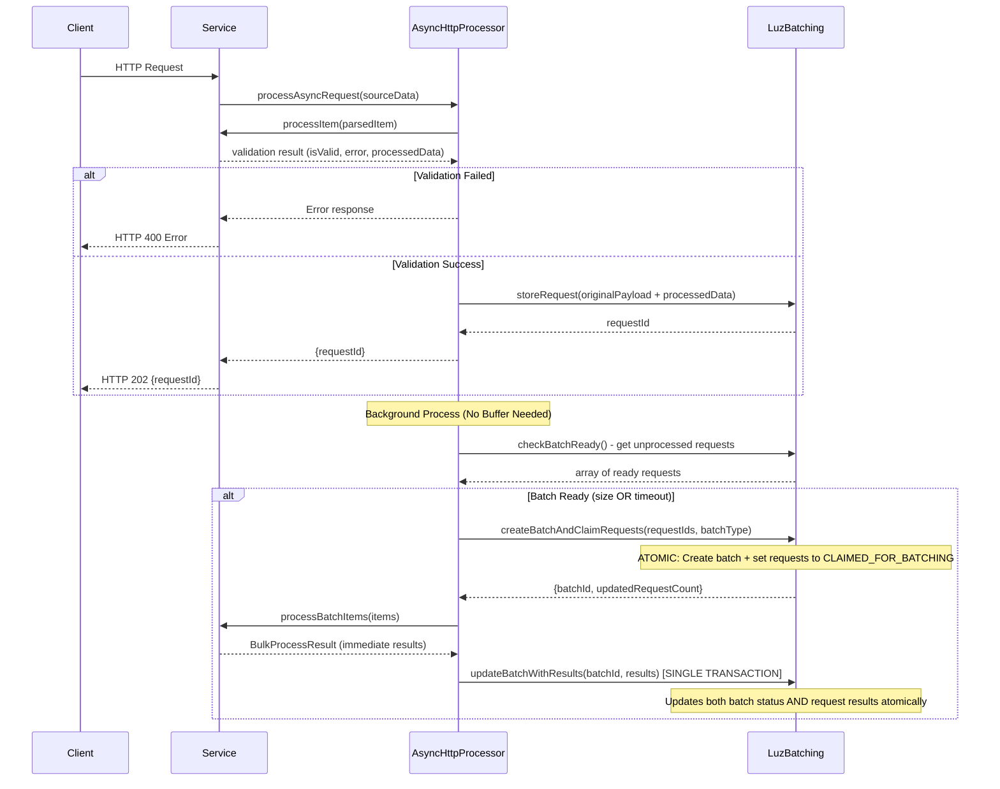

# Batch Processor Library - NodeJS

> [!info] Imported from Confluence
> Space **FUT** · updated 2025-09-23 · [open original](https://axonivy.atlassian.net/wiki/spaces/FUT/pages/48607559753/Batch+Processor+Library+-+NodeJS)
> Relevance 0.818 · topic `programming`

# Overview


![[48607559753-Batching Library Overview.png]]


# Use-cases


![[48607559753-Batching - Sync Request.png]]


add: 3rd party put the result back. polling can be optional.

<div id="expander-1068773181" class="expand-container conf-macro output-block" hasbody="true" macro-id="3a2a0a6e-afba-4308-8d4f-6df570be60ae" macro-name="expand">

<div id="expander-control-1068773181" class="expand-control">

<span class="expand-control-icon icon"> </span><span class="expand-control-text">Delay in Returning the Result to the Client - No Polling</span>

</div>

<div id="expander-content-1068773181" class="expand-content expand-hidden">


![[48607559753-image-20250820-020314.png]]


<div class="code panel pdl conf-macro output-block" hasbody="true" macro-id="64665fee-fc9c-4c5d-ba56-0a275001a4a7" macro-name="code" style="border-width: 1px;">

<div class="codeContent panelContent pdl">

```` syntaxhighlighter-pre

````

</div>

</div>

</div>

</div>

Moduled connect directly to the database or via a gateway module?

- 

# Class Diagram


![[48607559753-Batching_Class_Diagram.png]]


Updated version:


![[48607559753-image-20250923-021245.png]]


# Collection Design

1.  **Batches Collection**

<div>

|  |  |  |
|----|----|----|
| Field | Type | Explanation & Rationale |
| `_id` | `ObjectId` | The unique primary key for the batch document. |
| `tenantId` | `String` | **Denormalized for Performance.** The identifier for the client that initiated these requests. |
| `status` | `String` | The high-level state of the batch. **Statuses:** `PROCESSING`, `THIRD_PARTY_RESPONDED`, `SUCCESS`, `ERROR`. |
| `polling` | `Object` | An embedded document to manage the polling state for asynchronous third-party APIs. |
| `polling.state` | `String` | The specific state of the polling process (e.g., `"AWAITING_POLLING"`, `"POLLING_IN_PROGRESS"`, `"POLLING_COMPLETE"`). |
| `polling.trackingId` | `String` | The unique ID returned by the third party for the entire batch. |
| `polling.lastPoll` | `ISODate` | The timestamp of the last polling attempt. |
| `polling.nextPoll` | `ISODate` | The scheduled timestamp for the next polling attempt. |
| `polling.pollCount` | `Number` | The total number of polling attempts made so far. |
| `requestIds` | `Array of ObjectId` | An array of `_id` references to the individual request documents. |
| `errorDetails` | `Object` | **Corrected.** Stores structured information if the entire batch operation failed. |
| `errorDetails.errorCode` | `String` | An error errorCode. |
| `errorDetails.errorDescription` | `String` | A human-readable errorDescription of the error. |

</div>

<div id="expander-639870670" class="expand-container conf-macro output-block" hasbody="true" macro-id="7dae480e-e07d-447d-8217-cbcbcf3644db" macro-name="expand">

<div id="expander-control-639870670" class="expand-control">

<span class="expand-control-icon icon"> </span><span class="expand-control-text">Example</span>

</div>

<div id="expander-content-639870670" class="expand-content expand-hidden">

<div class="code panel pdl conf-macro output-block" hasbody="true" macro-id="677901fa-b2fe-4c64-a719-cf94b077c8ee" macro-name="code" style="border-width: 1px;">

<div class="codeContent panelContent pdl">

``` syntaxhighlighter-pre
{
  "_id": ObjectId("65e23c7c25a0753068f0f33a"),
  "tenantId": "cl_XYZ456",
  "status": "ERROR",
  "polling": {
    "state": "NOT_APPLICABLE",
    "trackingId": null,
    "lastPoll": null,
    "nextPoll": null,
    "pollCount": 0
  },
  "requestIds": [
    ObjectId("65e23c7c25a0753068f0f33b"),
    ObjectId("65e23c7c25a0753068f0f33c"),
    // ... 98 more ObjectIds
  ],
  "errorDetails": {
    "errorCode": "THIRD_PARTY_SERVICE_UNAVAILABLE",
    "errorDescription": "Third-party API returned 503 Service Unavailable on batch execution."
  }
}
```

</div>

</div>

</div>

</div>

2.  **Request Collection**

<div>

|  |  |  |
|----|----|----|
| Field | Type | Explanation & Rationale |
| `_id` | `ObjectId` | The unique identifier for this individual request. |
| `batchId` | `ObjectId` | A reference to the parent batch's `_id`. |
| `tenantId` | `String` | **Denormalized for Performance.** The identifier for the client that sent this request. |
| `idempotencyKey` | `String` | **Optional.** A unique key provided by the client to prevent duplicate request processing. |
| `originalPayload` | `Object` | The exact data payload from the client's original request. |
| `status` | `String` | The high-level status of the individual request. **Statuses:** `PENDING`, `CLAIMED_FOR_BATCHING`, `SUCCESS`, `ERROR`. |
| `result` | `Object` | An embedded document to store all result-related data for the request. |
| `result.rawResponse` | `Object` | The direct, unparsed response from the third-party service. |
| `result.processedPayload` | `Object` | The clean, transformed result ready for the client. |
| `result.errorDetails` | `Object` | **Corrected.** Stores structured error information if the individual request failed during processing. |
| `result.errorDetails.errorCode` | `String` | An error errorCode. |
| `result.errorDetails.errorDescription` | `String` | A human-readable errorDescription of the error. |

</div>

<div id="expander-981182043" class="expand-container conf-macro output-block" hasbody="true" macro-id="6bee9275-dc82-49b5-b340-3ddd51711dad" macro-name="expand">

<div id="expander-control-981182043" class="expand-control">

<span class="expand-control-icon icon"> </span><span class="expand-control-text">Example</span>

</div>

<div id="expander-content-981182043" class="expand-content expand-hidden">

<div class="code panel pdl conf-macro output-block" hasbody="true" macro-id="e73628b9-aef6-4782-9602-f2dd5537b417" macro-name="code" style="border-width: 1px;">

<div class="codeContent panelContent pdl">

``` syntaxhighlighter-pre
{
  "_id": ObjectId("65e23c7c25a0753068f0f33b"),
  "batchId": ObjectId("65e23c7c25a0753068f0f33a"),
  "tenantId": "cl_XYZ456",
  "idempotencyKey": "req_abc1234567",
  "originalPayload": {
    "id": 1,
    "data": "some-client-data"
  },
  "status": "ERROR",
  "result": {
    "rawResponse": null,
    "processedPayload": null,
    "errorDetails": {
      "errorCode": "THIRD_PARTY_REJECTION",
      "errorDescription": "Third-party service rejected the request due to an invalid payload."
    }
  }
}
```

</div>

</div>

</div>

</div>

# Meeting Notes

**17/09/2025:**

- Database or Service?

<div>

<table>
<colgroup>
<col style="width: 25%" />
<col style="width: 25%" />
<col style="width: 25%" />
<col style="width: 25%" />
</colgroup>
<tbody>
<tr>
<th></th>
<th><p><strong>Database (1 database)</strong></p></th>
<th><p><strong>Database (each database for each service)</strong></p></th>
<th><p><strong>Services</strong></p></th>
</tr>
&#10;<tr>
<td><p>Performance</p></td>
<td><p><span class="status-macro aui-lozenge aui-lozenge-visual-refresh aui-lozenge-success conf-macro output-inline" data-hasbody="false" data-macro-id="d0eb7739-7170-4069-be6e-2371a3e48837" data-macro-name="status">BETTER</span></p></td>
<td></td>
<td><p><span class="status-macro aui-lozenge aui-lozenge-visual-refresh aui-lozenge-error conf-macro output-inline" data-hasbody="false" data-macro-id="519c5af7-dc66-48ad-ae4a-3231e2057a41" data-macro-name="status">NOT GOOD</span></p></td>
</tr>
<tr>
<td><p>Design</p></td>
<td><p>2 data sources in 1 service is not a good design (database of service and database of batching)</p>
<p><span class="status-macro aui-lozenge aui-lozenge-visual-refresh aui-lozenge-error conf-macro output-inline" data-hasbody="false" data-macro-id="4b158974-f267-44cc-8209-5b50bea0d8c4" data-macro-name="status">NOT GOOD</span></p>
<p>Concern: 1 service cannot have 2 data sources (because luz-sec) - Maybe not a problem</p>
<p>1 database is used by many different service → Anti pattern of microservice.</p></td>
<td></td>
<td><p><span class="status-macro aui-lozenge aui-lozenge-visual-refresh aui-lozenge-success conf-macro output-inline" data-hasbody="false" data-macro-id="1b1ac2e4-5520-40b8-83a3-76a4e3ff2b5f" data-macro-name="status">BETTER</span></p></td>
</tr>
<tr>
<td><p>Complexity</p></td>
<td><p><span class="status-macro aui-lozenge aui-lozenge-visual-refresh aui-lozenge-success conf-macro output-inline" data-hasbody="false" data-macro-id="bda83d10-dd1a-4b18-8c4c-de8e2597bdbe" data-macro-name="status">BETTER</span></p></td>
<td></td>
<td><p><span class="status-macro aui-lozenge aui-lozenge-visual-refresh aui-lozenge-error conf-macro output-inline" data-hasbody="false" data-macro-id="b8b3a56e-8ca8-4a59-b193-98b8db97e6fc" data-macro-name="status">NOT GOOD</span></p></td>
</tr>
<tr>
<td><p>Update database</p></td>
<td><p><span class="status-macro aui-lozenge aui-lozenge-visual-refresh aui-lozenge-error conf-macro output-inline" data-hasbody="false" data-macro-id="b2a1a532-0940-4b8f-961a-0dcd3dd2aad0" data-macro-name="status">NOT GOOD</span></p></td>
<td></td>
<td><p><span class="status-macro aui-lozenge aui-lozenge-visual-refresh aui-lozenge-success conf-macro output-inline" data-hasbody="false" data-macro-id="0ba8bfbf-2e13-460c-a8bc-e0b67e1c406c" data-macro-name="status">BETTER</span> Only need to update the services if needed (like change name of collection)</p></td>
</tr>
</tbody>
</table>

</div>

=\> **Conclusion**: refer database but discuss later

- Configuration should split phase by phase

- remove processItem → service do it

- 1 job - 1 pod.

- Store raw data from third party first → then split result into original request.

**Next meeting**:

- Database design

- State machine

%% ai-graph-start %%

**Related notes:**
- [[Luz Batch TypeScript - Sequence Diagram]]
- [[Recipe Luz Batch TypeScript]]
- [[Batching Design]]
- [[Recipe Typescript batching]]
- [[Luz Batch TypeScript - Configuration]]

%% ai-graph-end %%